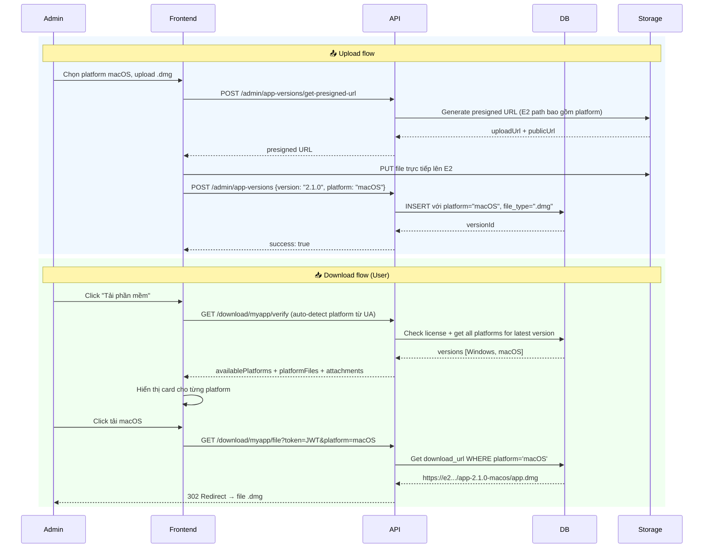

# 📦 Tài liệu Tính năng: Multi-Platform File (macOS & Windows)

> **Dự án:** License Active Manager  
> **Tổng hợp bởi:** Antigravity Agent  
> **Ngày:** 2026-03-18  
> **Trạng thái:** ✅ Hoàn thành (tất cả tasks đã done)

---

## 🎯 Mục tiêu

Cho phép **một version số** (ví dụ: `2.1.0`) có **nhiều bản build** cho các nền tảng khác nhau (Windows, macOS, Linux), mỗi nền tảng có file upload và download URL riêng biệt.

---

## 🗃️ 1. Database Schema

### Bảng `app_versions` (Migration `002`)

```sql
CREATE TABLE IF NOT EXISTS app_versions (
  id INT AUTO_INCREMENT PRIMARY KEY,
  app_id INT NOT NULL,
  version VARCHAR(32) NOT NULL,          -- Số version: "2.1.0"
  release_date DATE NOT NULL,
  release_notes TEXT NULL,
  download_url VARCHAR(512) NOT NULL,    -- URL file tải về
  file_name VARCHAR(255) NULL,           -- Tên file
  file_size BIGINT NULL,                 -- Bytes
  mandatory BOOLEAN NOT NULL DEFAULT FALSE,
  platform VARCHAR(32) NOT NULL DEFAULT 'windows',   -- 'Windows' | 'macOS' | 'Linux' | 'Web'
  file_type VARCHAR(32) NOT NULL DEFAULT 'zip',      -- '.exe' | '.dmg' | '.deb' (server tự suy ra)
  created_at DATETIME NOT NULL DEFAULT CURRENT_TIMESTAMP,
  updated_at DATETIME NOT NULL DEFAULT CURRENT_TIMESTAMP ON UPDATE CURRENT_TIMESTAMP,
  CONSTRAINT fk_app_versions_app FOREIGN KEY (app_id) REFERENCES apps(id) ON DELETE CASCADE,
  INDEX idx_app_id (app_id),
  INDEX idx_version (version),
  INDEX idx_created_at (created_at)
);
```

### Migration `011` — Multi-Platform UNIQUE Constraint

```sql
-- Backfill NULL platform thành 'Windows'
UPDATE app_versions SET platform = 'Windows' WHERE platform IS NULL OR platform = '';

-- UNIQUE constraint: (app_id, version, platform) thay vì (app_id, version)
-- → Cho phép cùng version số tồn tại với nhiều platform
ALTER TABLE app_versions
  ADD CONSTRAINT uq_app_version_platform UNIQUE (app_id, version, platform);
```

> ⚠️ **Key insight:** Trước đây unique constraint là `(app_id, version)`, ngăn tạo cùng version cho 2 platform. Migration 011 đổi thành `(app_id, version, platform)`.

---

## 🗺️ 2. Sơ đồ Platform → File Type

| Platform | File Extension | Content-Type |
|----------|---------------|--------------|
| Windows  | `.exe` / `.msi` | `application/x-msdownload` |
| macOS    | `.dmg`          | `application/x-apple-diskimage` |
| Linux    | `.deb`          | `application/x-debian-package` |
| Web      | N/A             | — |
| All      | `.zip`          | `application/zip` |

> **Server tự suy ra `file_type` từ extension của file upload** — không cần UI gửi lên.

---

## ⚙️ 3. Backend API

### File: `server/modules/app-versions.js`

#### `POST /admin/app-versions` — Tạo version mới

```
Validation:
  - Check duplicate: WHERE app_id = ? AND version = ? AND platform = ?
  - Nếu trùng → 400: "Version X already exists for platform Y"

Logic:
  - resolvedPlatform = platform || 'Windows'
  - resolvedFileType = extname(file_name) || '.zip'  (server tự suy ra)
  - INSERT vào app_versions với platform + file_type đã resolve
```

**Payload gửi lên:**
```json
{
  "app_id": 1,
  "version": "2.1.0",
  "release_date": "2026-03-17",
  "release_notes": "...",
  "download_url": "https://...",
  "file_name": "myapp-2.1.0.dmg",
  "file_size": 52428800,
  "mandatory": false,
  "platform": "macOS",
  "attachment_ids": []
}
```

#### `PUT /admin/app-versions/:id` — Cập nhật version

- Dynamic update query: chỉ update field nào được gửi lên
- Hỗ trợ update `platform`, `version`, `download_url`, `file_name`, `file_size`, `mandatory`, `attachment_ids`

#### Upload Endpoints

| Route | Mô tả |
|-------|-------|
| `POST /admin/app-versions/upload` | Upload file lên **VPS local** |
| `POST /admin/app-versions/upload-e2` | Upload file lên **iDrive E2 cloud** |
| `POST /admin/app-versions/get-presigned-url` | Lấy presigned URL để upload thẳng từ browser lên E2 |

**iDrive E2 — E2 Key generation với platform:**
```js
// Hàm generateE2Key() trong server/services/idrive-e2.js
export function generateE2Key(appCode, version, filename, platform) {
    const ext = path.extname(filename)
    // Normalize platform: 'macOS' → 'macos', 'Windows' → 'windows'
    const platformFolder = platform
        ? platform.toLowerCase().replace(/\s+/g, '-')
        : 'windows'
    // Format: releases/{appCode}/{platformFolder}/{appCode}-{version}.{ext}
    return `releases/${appCode}/${platformFolder}/${appCode}-${version}${ext}`
}
```

**Ví dụ URL thực tế:**
```
# macOS:
https://p2n2.c20.e2-8.dev/sd-automation/releases/content-auto-sondang/macos/content-auto-sondang-3.2.4.zip

# Windows:
https://p2n2.c20.e2-8.dev/sd-automation/releases/content-auto-sondang/windows/content-auto-sondang-3.2.4.zip
```

**Cấu trúc URL:**
```
{IDRIVE_E2_PUBLIC_URL}/{S3_KEY}
   └── https://p2n2.c20.e2-8.dev/sd-automation
                └── releases/{appCode}/{platform_lowercase}/{appCode}-{version}{ext}
```

**Accepted file types:**
```
.zip, .exe, .msi, .dmg, .deb, .app
```

---

### File: `server/modules/download.js`

#### `GET /download/:appCode/verify?platform=macOS` — Verify & lấy download info

```
Flow:
1. Auth check (requireAuth)
2. Tìm app theo code
3. Check active license của user
4. Lấy version number mới nhất (ORDER BY created_at DESC LIMIT 1)
5. Lấy tất cả platforms có cho version đó
6. Resolve target platform:
   - Nếu requestedPlatform có trong availablePlatforms → dùng nó
   - Fallback → 'Windows'
   - Fallback cuối → platform đầu tiên trong danh sách
7. Build platformFiles: mỗi platform có downloadUrl + token JWT (30 phút)
8. Trả về availablePlatforms + platformFiles + attachments
```

**Response:**
```json
{
  "authorized": true,
  "app": { "id": 1, "code": "myapp", "name": "My App", "icon_url": "..." },
  "version": { "id": 5, "version": "2.1.0", "release_date": "...", "release_notes": "..." },
  "availablePlatforms": ["Windows", "macOS"],
  "license": { "expires_at": "2027-01-01", "status": "active" },
  "platformFiles": [
    {
      "platform": "Windows",
      "filename": "myapp-2.1.0.exe",
      "size": 45000000,
      "file_type": ".exe",
      "downloadUrl": "https://.../download/myapp/file?token=JWT&platform=Windows"
    },
    {
      "platform": "macOS",
      "filename": "myapp-2.1.0.dmg",
      "size": 52000000,
      "file_type": ".dmg",
      "downloadUrl": "https://.../download/myapp/file?token=JWT&platform=macOS"
    }
  ],
  "attachments": [...]
}
```

#### `GET /download/:appCode/file?token=JWT&platform=macOS` — Tải file theo platform

```
Flow:
1. Verify JWT download token (expires in 30 phút)
2. Get version theo platform từ DB: WHERE app_id = ? AND platform = ?
3. Nếu không tìm thấy → fallback về any latest version
4. Nếu download_url là external (http/https) → redirect 302
5. Nếu VPS local → stream file trực tiếp
```

---

## 🖥️ 4. Frontend Components

### `components/AddAppVersion.tsx` — Form thêm/sửa version

**Tính năng:**
- **Đã xóa** dropdown "File Type" — server tự suy ra từ platform
- Dropdown "Platform" để chọn: Windows / macOS / Linux / Web / All
- Hiển thị **badge cảnh báo** nếu version + platform đã tồn tại
- Upload file hỗ trợ: `.zip`, `.exe`, `.msi`, `.dmg`, `.deb`
- Hỗ trợ 2 loại storage:
  - **VPS** (`/admin/app-versions/upload`)
  - **iDrive E2** (`/admin/app-versions/upload-e2` hoặc presigned URL)
- Sau khi tạo Windows xong → có gợi ý: *"Thêm bản macOS bằng cách tạo version mới với cùng version number"*

---

### `components/AppVersionHistory.tsx` — Lịch sử version (Admin)

**Tính năng:**
- **Group versions** có cùng số version thành 1 row
- Mỗi row hiển thị **platform badges** cho tất cả builds:
  ```
  v2.1.0  |  Mar 17, 2026  |  [🪟 Windows] [🍎 macOS]  |  Actions
  ```
- Actions **riêng theo từng build** (Edit / Download / Delete cho từng platform)
- 2 tab: **Phần mềm** (versions) và **File Attachment** (plugins)

**Platform Badge Map:**

| Platform | Emoji | Badge CSS |
|----------|-------|-----------|
| Windows  | 🪟    | `bg-blue-100 text-blue-700` |
| macOS    | 🍎    | `bg-zinc-100 text-zinc-700` |
| Linux    | 🐧    | `bg-orange-100 text-orange-700` |
| Web      | 🌐    | `bg-green-100 text-green-700` |
| All      | 📦    | `bg-purple-100 text-purple-700` |

**Grouping logic:**
```typescript
const groupedVersions = versions.reduce<GroupedVersion[]>((acc, v) => {
  const existing = acc.find(g => g.versionNumber === v.version);
  if (existing) {
    existing.builds.push(v);   // Cùng version số → gom vào 1 group
  } else {
    acc.push({ versionNumber: v.version, releaseDate: v.release_date, builds: [v] });
  }
  return acc;
}, []);
```

---

### `components/DownloadModal.tsx` — Modal tải phần mềm (User)

**Interface `DownloadInfo`:**
```typescript
interface DownloadInfo {
  authorized: boolean
  app: { id: number; code: string; name: string }
  version: { id: number; version: string; release_date: string; release_notes: string | null }
  availablePlatforms: string[]      // ["Windows", "macOS"]
  license: { expires_at: string; status: string }
  platformFiles: {
    platform: string
    filename: string
    size: number
    file_type: string
    downloadUrl: string             // URL có JWT token (30 phút)
  }[]
  attachments: { id: number; description: string; filename: string; size: number; downloadUrl: string }[]
}
```

**Tính năng:**
- **Auto-detect OS** của user khi mở modal:
  ```typescript
  function detectUserPlatform(): string {
    const ua = navigator.userAgent.toLowerCase()
    if (ua.includes('mac os x') || ua.includes('macintosh')) return 'macOS'
    if (ua.includes('linux') && !ua.includes('android')) return 'Linux'
    return 'Windows'
  }
  ```
- Hiển thị **card download riêng cho từng platform** (không còn 1 nút duy nhất)
- Hiển thị thông tin file: tên file, dung lượng
- Nếu user mở modal trên macOS → tự ưu tiên hiển thị bản macOS
- States: `Loading` → `Error` (auth/license/other) → `Success` (platformFiles + attachments)

---

## 🔄 5. Luồng dữ liệu hoàn chỉnh



---

## ✅ 6. Checklist hoàn thành

| # | Task | File | Status |
|---|------|------|--------|
| 1 | DB Migration: Unique constraint `(app_id, version, platform)` | `011_multi_platform_versions.sql` | ✅ Done |
| 2 | Backend: Đổi validation check duplicate theo platform | `app-versions.js` | ✅ Done |
| 3 | Backend: `/verify` trả về `availablePlatforms` + `platformFiles` | `download.js` | ✅ Done |
| 4a | Frontend: Xóa dropdown "File Type" khỏi AddAppVersion | `AddAppVersion.tsx` | ✅ Done |
| 4b | Backend: Server tự suy ra `file_type` từ extension file | `app-versions.js` | ✅ Done |
| 5 | Frontend: AppVersionHistory group version + platform badges | `AppVersionHistory.tsx` | ✅ Done |
| 6 | Frontend: DownloadModal hiển thị card per platform + auto-detect OS | `DownloadModal.tsx` | ✅ Done |

---

## ⚠️ 7. Lưu ý kỹ thuật

### Backward Compatibility
Cột `file_type` trong DB **vẫn giữ nguyên**. Các version Windows cũ (trước multi-platform) vẫn hoạt động bình thường. Field này không còn hiển thị trên UI.

### Cảnh báo Migration
**Migration 011** cần được chạy **TRƯỚC** khi upload version mới. Nếu DB còn duplicate data `(version, platform)` thì migration sẽ fail — cần clean data trước.

### iDrive E2 vs VPS — Multi-platform

**iDrive E2 — Key format thực tế:**
```
S3 Key : releases/{appCode}/{platform_lowercase}/{appCode}-{version}{ext}
Public  : {IDRIVE_E2_PUBLIC_URL}/{S3_Key}

Ví dụ macOS  : releases/content-auto-sondang/macos/content-auto-sondang-3.2.4.zip
Ví dụ Windows: releases/content-auto-sondang/windows/content-auto-sondang-3.2.4.zip
```

- **iDrive E2**: platform phân tách bằng **thư mục riêng** (`/macos/`, `/windows/`) → tránh overwrite ✅
- **VPS local**: Chỉ dùng `{appCode}-{version}{ext}` → **không phân biệt platform** → nên dùng E2 nếu upload nhiều platform ⚠️

> **Lưu ý:** Platform được normalize về lowercase: `macOS` → `macos`, `Windows` → `windows`, `Linux` → `linux`

### Download Token (JWT)
Token chỉ có hiệu lực **30 phút**. Frontend **phải gọi `/verify`** mỗi lần user mở DownloadModal để lấy token mới — không cache lại token cũ.

---

## 📁 8. File liên quan

| File | Loại | Mô tả |
|------|------|-------|
| `server/sql/migrations/011_multi_platform_versions.sql` | SQL | DB migration thêm UNIQUE constraint per platform |
| `server/sql/migrations/002_create_app_versions_table.sql` | SQL | Schema gốc bảng `app_versions` |
| `server/modules/app-versions.js` | Backend | API: create / update / upload / delete version |
| `server/modules/download.js` | Backend | API: verify license + download by platform |
| `components/AddAppVersion.tsx` | Frontend | Form thêm/sửa version (Admin) |
| `components/AppVersionHistory.tsx` | Frontend | Bảng lịch sử version, group theo platform |
| `components/DownloadModal.tsx` | Frontend | Modal tải phần mềm, hiển thị theo platform |
